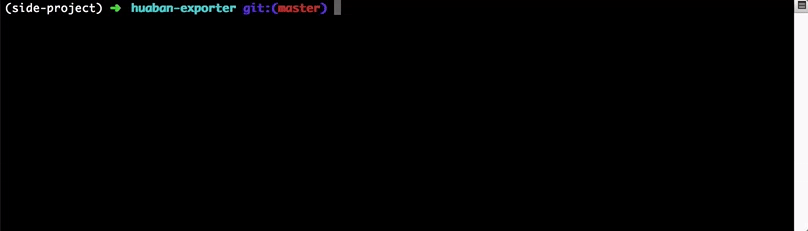

huaban-exporter
-----------------
这个工具帮你导出你的花瓣元数据和图库到本地

切换到Pinterest或者自建一个图库吧：）



已经有一些现成工具了，但是不支持保存元数据。

花瓣完全放不了敏感图，所以还是转向了Pinterest，转移的话不仅仅是上传图片就行，还需要图片的元数据，之前的采集才有意义。有同学想要自建当然是坠吼的！


# 特性
+ 保存元数据，为你转移到别的平台做准备，保留了link，title，description等Pin最重要的信息
+ 图片下载到Board名字命名的文件夹内
+ 支持下载线程数设置：）

# 安装

## 从PyPi安装
```shell
pip install huaban-exporter
```
## 从项目安装

```shell
git clone https://github.com/winkidney/huaban-exporter.git
cd huaban-exporter
python setup.py develop
```

## 运行

```
huaban download http://<url_to_home_page_of_the_user> --workers <download workers>
```

根文件夹将会以用户名命名，文件夹名称将会是Board的名字，所有的元数据（包含Link，Title之类的）都保存在 `meta.json` 内


## About

Author：https://github.com/winkidney/
